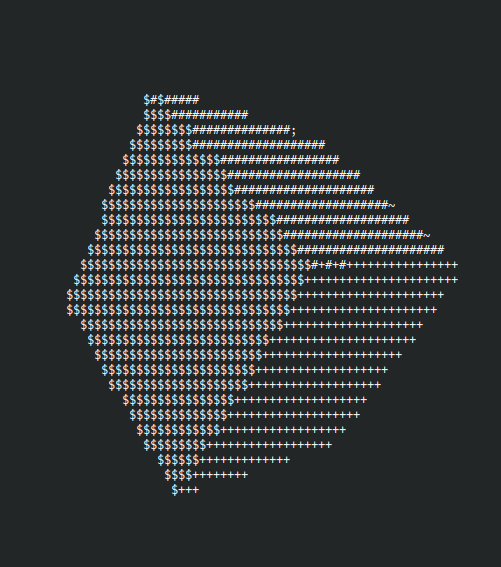

# cube-rs
Spinning Cube



## Run

```
cargo run --release
```

## Build for [wasmtime](https://github.com/bytecodealliance/wasmtime)

```
rustup target add wasm32-wasi
cargo wasm-build
```

and run it

```
wasmtime target/wasm32-wasi/release/cube-rs.wasm
```
